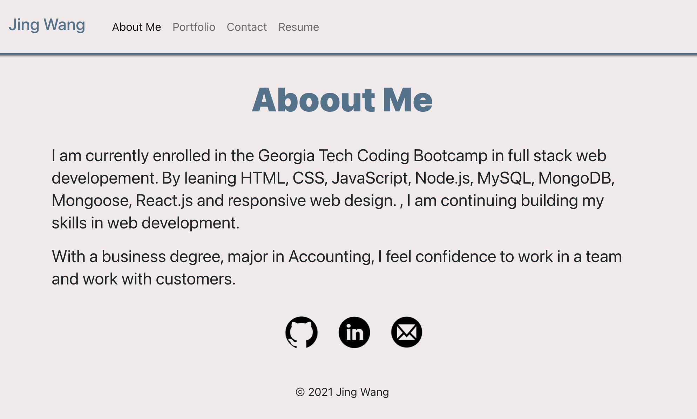

# Portfolio React


## Description

It is a personal portfolio template build with React. It used to show p

## Table of Content

- [URL Link to GitHub Repository](#url-link-to-github-repository)
- [URL link to deploy in Github page](#url-link-to-deploy-in-GitHub-page)
- [Mock-Up Image](#mock-up-image)
- [Installation](#installation)
- [License](#license)
- [Questions](#questions)

## URL Link to GitHub Repository

https://github.com/jingwang6028/Portfolio-React

## URL link to deploy in GitHub page

https://jingwang6028.github.io/Portfolio-React/

## Mock-Up Image

Home Page


## Installation

1. For install npm packages, run command:
   ```
   npm i
   ```
2. To run this app
   ```
   npm start
   ```

## License

This project is licensed under the MIT license.

## Questions

If you have any questions about the repo, open an issue or contact me directly at jingwang6028@gmail.com. You can find more of my work at [jingwang6028](https://github.com/jingwang6028).
